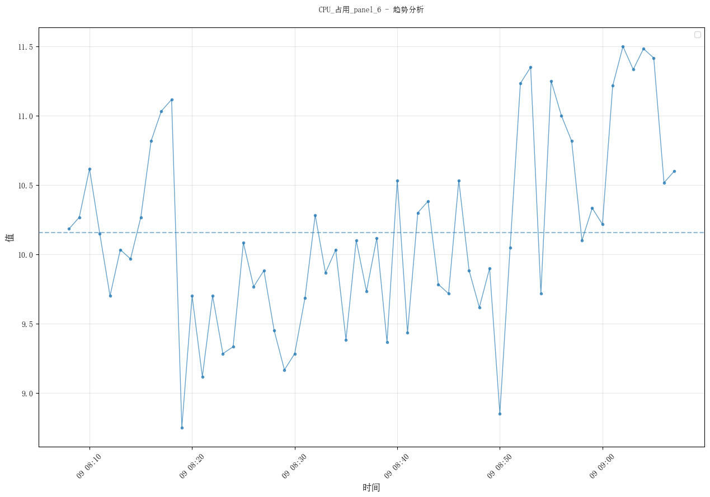
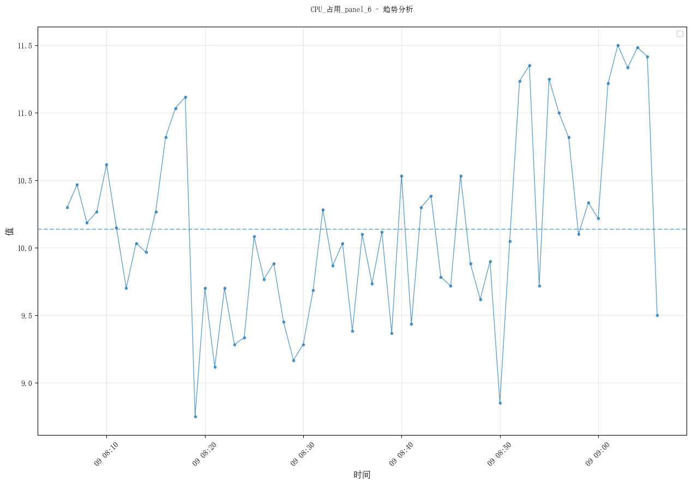

# 性能测试报告

生成时间：2025-05-09 09:08:33

## 比较概览

本报告比较了两个时间段的性能数据：

- **新数据**：2025-05-09-09:08
- **旧数据**：2025-05-09-09:06

分析了 7 个共同的性能指标。

## 目录

- [垃圾回收耗时统计_panel_5](#垃圾回收耗时统计-panel-5)
- [线程数量_panel_4](#线程数量-panel-4)
- [CPU_占用_panel_6](#cpu-占用-panel-6)
- [物理内存占用_panel_1](#物理内存占用-panel-1)
- [内存分配趋势_panel_7](#内存分配趋势-panel-7)
- [go_routine_panel_2](#go-routine-panel-2)
- [堆内存使用情况_panel_3](#堆内存使用情况-panel-3)

## 垃圾回收耗时统计_panel_5

### 数据概览

- **新数据时间范围**：2025-05-09 08:08:00 到 2025-05-09 09:06:00
- **新数据点数**：59
- **旧数据时间范围**：2025-05-09 08:06:00 到 2025-05-09 09:05:00
- **旧数据点数**：60

### 统计比较

|指标|旧数据|新数据|变化|变化百分比|
|---|---|---|---|---:|
|__auto_3|0.00|0.00|-0.00|0.02% ↓|
|__auto_1|0.00|0.00|0.00|0.02% ↑|
|__auto|0.00|0.00|0.00|0.00% |
|__auto_2|0.00|0.00|0.00|0.11% ↑|
|__auto_4|0.00|0.00|0.00|0.00% |

### 可视化分析

#### 趋势比较

**新数据趋势**：

**旧数据趋势**：

#### 指标比较图表

### 性能比较结论

**未知 指标无显著变化**：指标变化较小，表明性能稳定。

## 线程数量_panel_4

### 数据概览

- **新数据时间范围**：2025-05-09 08:08:00 到 2025-05-09 09:06:00
- **新数据点数**：59
- **旧数据时间范围**：2025-05-09 08:06:00 到 2025-05-09 09:05:00
- **旧数据点数**：60

### 统计比较

|指标|旧数据|新数据|变化|变化百分比|
|---|---|---|---|---:|
|__auto|26.00|26.00|0.00|0.00% |

### 可视化分析

#### 趋势比较

**新数据趋势**：

**旧数据趋势**：

#### 指标比较图表

### 性能比较结论

**未知 指标无显著变化**：指标变化较小，表明性能稳定。

## CPU_占用_panel_6

### 数据概览

- **新数据时间范围**：2025-05-09 08:08:00 到 2025-05-09 09:07:00
- **新数据点数**：60
- **旧数据时间范围**：2025-05-09 08:06:00 到 2025-05-09 09:06:00
- **旧数据点数**：61

### 统计比较

|指标|旧数据|新数据|变化|变化百分比|
|---|---|---|---|---:|
|__auto|10.14|10.15|0.02|0.16% ↑|

### 可视化分析

#### 趋势比较

**新数据趋势**：

**旧数据趋势**：

#### 指标比较图表

### 性能比较结论

**CPU/负载 指标无显著变化**：指标变化较小，表明性能稳定。

## 物理内存占用_panel_1

### 数据概览

- **新数据时间范围**：2025-05-09 08:08:00 到 2025-05-09 09:06:00
- **新数据点数**：59
- **旧数据时间范围**：2025-05-09 08:06:00 到 2025-05-09 09:05:00
- **旧数据点数**：60

### 统计比较

|指标|旧数据|新数据|变化|变化百分比|
|---|---|---|---|---:|
|__auto|528343927.47|530621665.63|2277738.16|0.43% ↑|

### 可视化分析

#### 趋势比较

**新数据趋势**：

**旧数据趋势**：

#### 指标比较图表

### 性能比较结论

**内存 指标无显著变化**：指标变化较小，表明性能稳定。

## 内存分配趋势_panel_7

### 数据概览

- **新数据时间范围**：2025-05-09 08:08:00 到 2025-05-09 09:06:00
- **新数据点数**：59
- **旧数据时间范围**：2025-05-09 08:06:00 到 2025-05-09 09:05:00
- **旧数据点数**：60

### 统计比较

|指标|旧数据|新数据|变化|变化百分比|
|---|---|---|---|---:|
|__auto|616406830.53|617497344.68|1090514.14|0.18% ↑|

### 可视化分析

#### 趋势比较

**新数据趋势**：

**旧数据趋势**：

#### 指标比较图表

### 性能比较结论

**内存 指标无显著变化**：指标变化较小，表明性能稳定。

## go_routine_panel_2

### 数据概览

- **新数据时间范围**：2025-05-09 08:08:00 到 2025-05-09 09:06:00
- **新数据点数**：59
- **旧数据时间范围**：2025-05-09 08:06:00 到 2025-05-09 09:05:00
- **旧数据点数**：60

### 统计比较

|指标|旧数据|新数据|变化|变化百分比|
|---|---|---|---|---:|
|__auto|283.23|283.27|0.04|0.01% ↑|

### 可视化分析

#### 趋势比较

**新数据趋势**：

**旧数据趋势**：

#### 指标比较图表

### 性能比较结论

**未知 指标无显著变化**：指标变化较小，表明性能稳定。

## 堆内存使用情况_panel_3

### 数据概览

- **新数据时间范围**：2025-05-09 08:08:00 到 2025-05-09 09:06:00
- **新数据点数**：59
- **旧数据时间范围**：2025-05-09 08:06:00 到 2025-05-09 09:05:00
- **旧数据点数**：60

### 统计比较

|指标|旧数据|新数据|变化|变化百分比|
|---|---|---|---|---:|
|__auto|3188326.40|3189603.80|1277.40|0.04% ↑|

### 可视化分析

#### 趋势比较

**新数据趋势**：

**旧数据趋势**：

#### 指标比较图表

### 性能比较结论

**内存 指标无显著变化**：指标变化较小，表明性能稳定。

## 总体结论

### 总体性能变化图表

根据比较结果，系统性能变化总结如下：

- **未知**：稳定 0.01%。
1. **CPU/负载**：稳定 0.16%，系统负载稳定。
2. **内存**：稳定 0.22%，内存使用稳定。

**建议**：未发现显著变化 (维持当前配置。)
